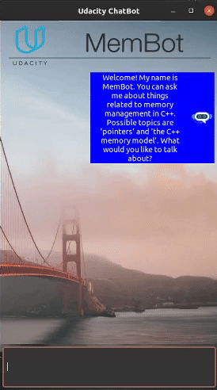
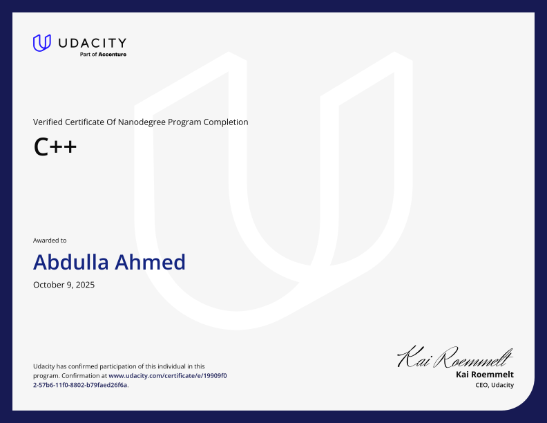

# Udacity C++ Nanodegree Program

This repository contains my implementations of the projects from the Udacity C++ Nanodegree program. Each project applies core C++ principles in a practical context. 

## Project 1 – Route Planning

The first project focuses on implementing the A* search algorithm to find the shortest path between two points on an OpenStreetMap-based layout.

  

  <em>Path computed using A* algorithm over OpenStreetMap data</em>

  <a href="https://github.com/abdullaxahmed/Udacity-Cpp-Nanodegree/tree/main/Project-1%20Route%20Planning" style="
    display: inline-block;
    padding: 5px 5px;
    font-size: 10px;
    font-weight: bold;
    color: white;
    background-color: #165798e1;
    border-radius: 6px;
    text-decoration: none;
  ">📂 /Project 1</a>

## Project 2 – System Monitor

This project involves building a simplified version of the Linux `htop` process viewer using C++. It reads system data from the `/proc` file system and displays CPU usage, memory stats, and running processes. The implementation emphasizes object-oriented programming principles and efficient data parsing.

  

  <em>System monitor displaying CPU, memory, and process information</em>

  <a href="https://github.com/abdullaxahmed/Udacity-Cpp-Nanodegree/tree/main/Project-2%20System%20Monitor" style="
    display: inline-block;
    padding: 5px 5px;
    font-size: 10px;
    font-weight: bold;
    color: white;
    background-color: #165798e1;
    border-radius: 6px;
    text-decoration: none;
  ">📂 /Project 2</a>

### Project 3 – Memory Management Chatbot

This project implements a chatbot application with a focus on memory management techniques. It demonstrates proper use of smart pointers, move semantics, and the Rule of Five. The chatbot uses a dialogue tree structure to simulate conversations and showcases efficient resource handling in C++.

  

  <em>Interactive chatbot demonstrating advanced memory management</em>

  <a href="https://github.com/abdullaxahmed/Udacity-Cpp-Nanodegree/tree/main/Project-3%20Memory%20Management%20Chatbot" style="
    display: inline-block;
    padding: 5px 5px;
    font-size: 10px;
    font-weight: bold;
    color: white;
    background-color: #165798e1;
    border-radius: 6px;
    text-decoration: none;
  ">📂 /Project 3</a>

---

### Project 4 – Concurrent Traffic Simulation

This project simulates traffic flow at intersections using concurrent programming techniques. It implements multi-threaded vehicle movement, traffic lights with proper synchronization, and demonstrates the use of mutexes, locks, and condition variables to manage shared resources safely.

  

  <em>Multi-threaded traffic simulation with synchronized intersections</em>

  <a href="https://github.com/abdullaxahmed/Udacity-Cpp-Nanodegree/tree/main/Project-4%20Concurrent%20Traffic%20Simulation" style="
    display: inline-block;
    padding: 5px 5px;
    font-size: 10px;
    font-weight: bold;
    color: white;
    background-color: #165798e1;
    border-radius: 6px;
    text-decoration: none;
  ">📂 /Project 4</a>

---

### Project 5 – Capstone Project: Vehicle Detection

A high-performance C++ application for real-time vehicle detection using OpenCV's background subtraction and contour analysis techniques. This capstone project synthesizes all concepts learned throughout the nanodegree program, including OOP, memory management, and concurrency.

  

  <em>Real-time vehicle detection with MOG2 background subtraction</em>

  <a href="https://github.com/abdullaxahmed/Udacity-Cpp-Nanodegree-Capstone-Project" style="
    display: inline-block;
    padding: 5px 5px;
    font-size: 10px;
    font-weight: bold;
    color: white;
    background-color: #165798e1;
    border-radius: 6px;
    text-decoration: none;
  ">📂 View Capstone Project Repository</a>

**Key Features:**
- Multi-threaded architecture with reader and worker threads
- MOG2 (Mixture of Gaussians) background subtraction
- Morphological operations for noise reduction
- Contour detection and feature extraction
- Real-time performance logging and visualization

---

## Certification

  

  <a href="https://www.udacity.com/certificate/e/19909f02-57b6-11f0-8802-b79faed26f6a" style="
    display: inline-block;
    padding: 10px 20px;
    font-size: 14px;
    font-weight: bold;
    color: white;
    background-color: #02B3E4;
    border-radius: 6px;
    text-decoration: none;
  ">🎓 View Certificate Credential</a>

---
